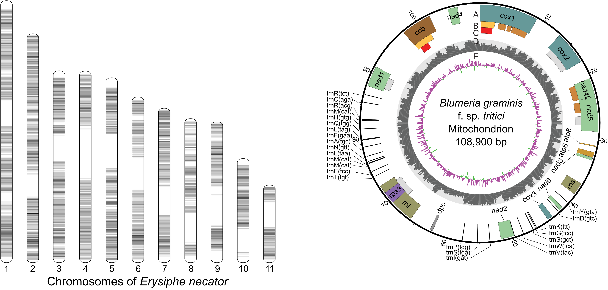

I have assembled and annotated many fungal genomes. The following table shows those that are publicly available at [NCBI](https://www.ncbi.nlm.nih.gov).

<table>
  <tr>
    <th>Species</th>
    <th>Isolate</th>
    <th>Type</th>
    <th>Genes</th>
    <th>Accession</th>
    <th>Reference</th>
  </tr>
  
    <tr>
      <td>{{ row.Species }}</td>
      <td>{{ row.Isolate }}</td>
      <td>{{ row.Type }}</td>
      <td>{{ row.Genes }}</td>
      <td><a href="{{ row.URL }}">{{ row.Accession }}</a></td>
      <td><a href="{{ row.REF }}">{{ row.Reference }}</a></td>
    </tr>
  
</table>

Scripts and code snippets I used to analyze these genomes are available as repositories in my [GitHub page](https://github.com/alexzaccaron).